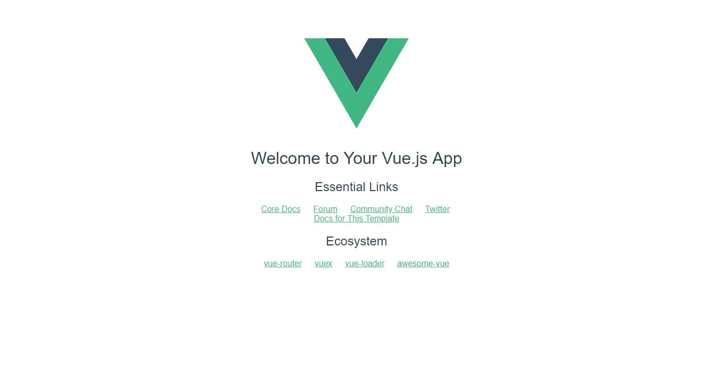

# Vue.js
    0
        参考资料
            url 
                https://www.runoob.com/vue2/vue-tutorial.html
    1
        介绍
            Vue.js（读音 /vjuː/, 类似于 view） 是一套构建用户界面的渐进式框架。
            Vue 只关注视图层， 采用自底向上增量开发的设计。
            Vue 的目标是通过尽可能简单的 API 实现响应的数据绑定和组合的视图组件。
            Vue 学习起来非常简单，本教程基于 Vue 2.1.8 版本测试。
    2
        安装
            1、独立版本
                我们可以在 Vue.js 的官网上直接下载 vue.min.js 并用 
                            </head>
                            <body>
                            

                              
{{ message }}

                            

                            
                            
                            </body>
                            </html>
                    unpkg：
                        https://unpkg.com/vue/dist/vue.js, 会保持和 npm 发布的最新的版本一致。
                            <!DOCTYPE html>
                            <html>
                            <head>
                            <meta charset="utf-8">
                            <title>Vue 测试实例 - 菜鸟教程(runoob.com)</title>
                            
                            </head>
                            <body>
                            

                              
{{ message }}

                            

                            
                            
                            </body>
                            </html>
                   
                    cdnjs : 
                        https://cdnjs.cloudflare.com/ajax/libs/vue/2.1.8/vue.min.js 
                            <!DOCTYPE html>
                            <html>
                            <head>
                            <meta charset="utf-8">
                            <title>Vue 测试实例 - 菜鸟教程(runoob.com)</title>
                            </head>
                            <body>
                            
                            
                            

                              
{{ message }}

                            

                            
                            
                            </body>
                            </html>
            3、NPM 方法
                由于 npm 安装速度慢，本教程使用了淘宝的镜像及其命令 cnpm
                    参考资料
                        https://www.runoob.com/nodejs/nodejs-npm.html#taobaonpm
                        使用淘宝 NPM 镜像
                            大家都知道国内直接使用 npm 的官方镜像是非常慢的，这里推荐使用淘宝 NPM 镜像。
                            淘宝 NPM 镜像是一个完整 npmjs.org 镜像，你可以用此代替官方版本(只读)，同步频率目前为 10分钟 一次以保证尽量与官方服务同步。
                            你可以使用淘宝定制的 cnpm (gzip 压缩支持) 命令行工具代替默认的 npm:
                                npm install -g cnpm --registry=https://registry.npm.taobao.org
                            这样就可以使用 cnpm 命令来安装模块了：
                                cnpm install [name]
                    首先安装Node.js
                        参考
                            readme/Node.js.md:30
                    在用 Vue.js 构建大型应用时推荐使用 NPM 安装：
                        C:\Users\h_don>cnpm install vue
                        √ Installed 1 packages
                        √ Linked 0 latest versions
                        √ Run 0 scripts
                        √ All packages installed (1 packages installed from npm registry, used 1s(network 1s), speed 758.32kB/s, json 1(25.59kB), tarball 824.49kB)
                        
                        C:\Users\h_don>
        命令行工具
            Vue.js 提供一个官方命令行工具，可用于快速搭建大型单页应用。
                # 全局安装 vue-cli
                    C:\Users\h_don>cnpm install --global vue-cli
                # 创建一个基于 webpack 模板的新项目(初始化项目)
                    C:\Users\h_don>vue init webpack my-project
                #这里需要进行一些配置，默认回车即可
                    ? Project name my-project
                    ? Project description A Vue.js project
                    ? Author haodonghui <h_donghui@sian.cn>
                    ? Vue build standalone
                    ? Install vue-router? Yes
                    ? Use ESLint to lint your code? Yes
                    ? Pick an ESLint preset Standard
                    ? Set up unit tests Yes
                    ? Pick a test runner jest
                    ? Setup e2e tests with Nightwatch? Yes
                    ? Should we run `npm install` for you after the project has been created? (recommended) npm
                    
                       vue-cli · Generated "my-project".
                    ....
                    Running eslint --fix to comply with chosen preset rules...
                    # ========================
                    
                    
                    > my-project@1.0.0 lint C:\Users\h_don\my-project
                    > eslint --ext .js,.vue src test/unit test/e2e/specs "--fix"
                    
                    
                    # Project initialization finished!
                    # ========================
                    
                    To get started:
                    
                      cd my-project
                      npm run dev
                    
                    Documentation can be found at https://vuejs-templates.github.io/webpack
                            
                            
                            
                    C:\Users\h_don>
                # 进入项目，安装并运行：
                    安装
                        PS C:\Users\h_don\my-project> cnpm install
                        √ Installed 58 packages
                        √ Linked 0 latest versions
                        √ Run 0 scripts
                        √ All packages installed (used 84ms(network 74ms), speed 0B/s, json 0(0B), tarball 0B)
                    运行
                        PS C:\Users\h_don\my-project> cnpm run dev
                        
                        > my-project@1.0.0 dev C:\Users\h_don\my-project
                        > webpack-dev-server --inline --progress --config build/webpack.dev.conf.js
                        
                         12% building modules 23/31 modules 8 active ...C:\Users\h_don\my-project\src\App.vue{ parser: "babylon" } is deprecated; we now treat it as { parser: "babel" }.
                         95% emitting
                        
                         DONE  Compiled successfully in 9585ms                                                                       11:54:15 AM
                        
                         I  Your application is running here: http://localhost:8080
                     
                    成功执行以上命令后访问 http://localhost:8080/，输出结果如下所示：

            
            至此第一个vue项目my-project搭建运行完毕
    
    3
        注意：Vue.js 不支持 IE8 及其以下 IE 版本。
                    