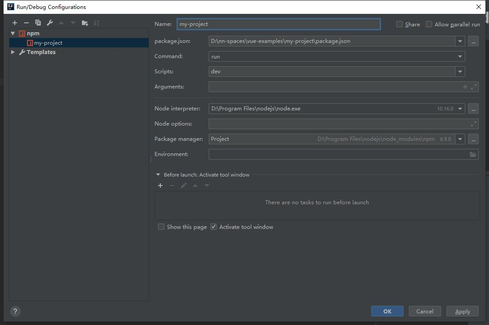

# ideay运行vue项目
    0
        参考资料
            url
                https://www.csdn.net/gather_2f/MtTaAgwsMTA1Ny1ibG9n.html
    1
        设置idea
            1.1
                File - Settings - Languages&Frameworks - JavaScript：修改JavaScript language version为ECMAScript 6，确认
            1.2
                File - Settings - Plugins：搜索vue，安装Vue.js
            1.3
                Run - Edit Configurations...：点击加号，选择npm，Name为my-project，package.json选择你工程中的package.json，
                Command为run，Scripts为dev,然后就可以直接在idea中运行了

                
                   "D:\Program Files\nodejs\node.exe" "D:\Program Files\nodejs\node_modules\npm\bin\npm-cli.js" run dev --scripts-prepend-node-path=auto
                   
                   > my-project@1.0.0 dev D:\nn-spaces\vue-examples\my-project
                   > webpack-dev-server --inline --progress --config build/webpack.dev.conf.js
                   
                    12% building modules 23/31 modules 8 active ...s\vue-examples\my-project\src\App.vue{ parser: "babylon" } is deprecated; we now treat it as { parser: "babel" }.
                    95% emitting DONE  Compiled successfully in 11619ms12:29:17 PM
                   
                    I  Your application is running here: http://localhost:8080
                    
                访问 http://localhost:8080即可